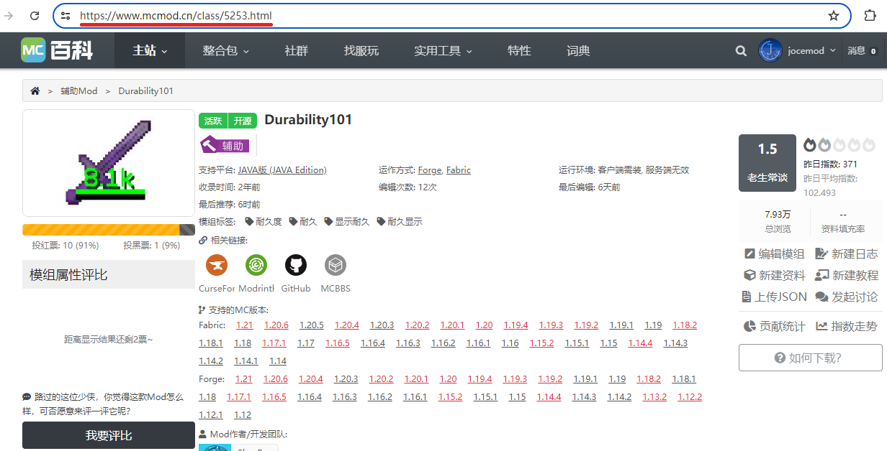

## 仓库说明

mcmod的签到助手,帮助你每天自动签到窜门和推荐模组

## 配置文件

初次使用会生成默认的配置文件,配置文件如下:

| 键名 | 默认设置 | 参数类型 | 备注 |
| :----: | :----: | :----: | :----: |
| display_windows | false | 布尔 | 是否显示浏览器窗口 |
| cookie_refresh | 30 | 整数 | cookie更新时间,默认30天更新一次 |
| user_name | default | 字符串 | 你的用户名 |
| password | root123 | 字符串 | 你的密码 |
| min_waiting_time | 0 | 正数 | 两个操作间随机延迟的最小时间,必须比max_waiting_time小 |
| max_waiting_time | 5 | 正数 | 两个操作间随机延迟的最大时间,必须比min_waiting_time大 |
| visited_user | 2 | 整数 | 被窜门的用户的uid |
| recommend_mod | https://www.mcmod.cn/class/5253.html | 字符串 | 被推荐的模组的url |
| uid | 2 | 整数 | 自己的uid |

**user_name:**

**password:**

**visited_user:**

**recommend_mod:**

**uid:**

## 使用方式

需要安装浏览器,并可被系统调用**Google Chrome**以及[GoogleDriver](https://googlechromelabs.github.io/chrome-for-testing/)(下载完解压到运行目录下)

Windows:下载[mcmod.exe](https://github.com/jocemod/mcmod_helper/releases/tag/main),直接运行

Linux&MacOs:安装python环境和selenium库,下载源码运行
